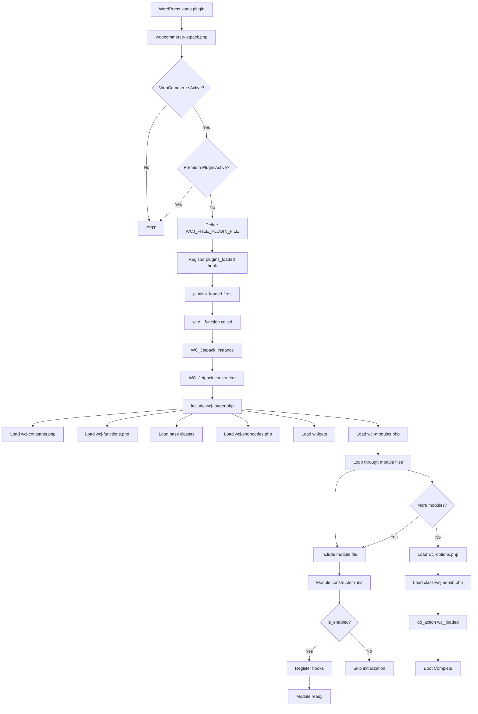

# Boot Sequence

**Key Takeaways:**
- Plugin initializes on `plugins_loaded` hook via `w_c_j()` function
- WooCommerce must be active (checked early)
- Premium plugins (Plus/Elite) take precedence if active - free version exits
- Modules load either immediately or on `init` hook (configurable)
- All modules instantiate and register their hooks in one pass

---

## Boot Flow Overview

```
1. WordPress loads plugin
2. woocommerce-jetpack.php executes
3. Core functions loaded (wcj-functions-core.php)
4. WooCommerce active check - EXIT if not active
5. Premium plugin check - EXIT if Plus/Elite active
6. Define WCJ_FREE_PLUGIN_FILE constant
7. Register plugins_loaded hook -> w_c_j()
8. w_c_j() instantiates WC_Jetpack singleton
9. WC_Jetpack constructor loads wcj-loader.php
10. wcj-loader.php orchestrates full boot
```

---

## Detailed Boot Sequence

### Phase 1: Plugin File Entry (`woocommerce-jetpack.php`)

```php
// Line 26: First file loaded - core functions
require_once 'includes/functions/wcj-functions-core.php';

// Line 29-31: WooCommerce check (exit if not active)
if ( ! wcj_is_plugin_activated( 'woocommerce', 'woocommerce.php' ) ) {
    return;
}

// Line 34-41: HPOS compatibility declaration (before_woocommerce_init hook)

// Line 44-51: Premium plugin check - exit if Plus/Elite/Basic/Pro active
if ( 'woocommerce-jetpack.php' === basename( __FILE__ ) &&
    ( wcj_is_plugin_activated( 'booster-plus-for-woocommerce', ... ) || ... )
) {
    return;
}

// Line 53-60: Define WCJ_FREE_PLUGIN_FILE constant

// Line 62-163: Define WC_Jetpack class (singleton)

// Line 215-236: Plugin usage tracking (Wisdom)

// Line 238: Hook main initialization
add_action( 'plugins_loaded', 'w_c_j' );

// Line 241-306: Activation/update redirect handling
```

### Phase 2: Singleton Initialization (`w_c_j()` function)

```php
// Line 174-176
function w_c_j() {
    return WC_Jetpack::instance();
}
```

### Phase 3: Loader Execution (`includes/core/wcj-loader.php`)

The loader orchestrates the full initialization:

```php
// Line 16-18: Debug mode check (error_reporting)

// Line 20-28: Define WCJ_FREE_PLUGIN_PATH constant

// Line 31-41: Localization (load_plugin_textdomain)
// Can load immediately or on 'init' hook based on wcj_load_modules_on_init option

// Line 46: Constants (wcj-constants.php)
require_once 'wcj-constants.php';

// Line 49: All helper functions
require_once 'wcj-functions.php';

// Line 52: Quick Start Presets
require_once WCJ_FREE_PLUGIN_PATH . '/includes/wcj-quick-start-presets.php';

// Line 55-57: Quick Start Admin UI (admin only)
if ( is_admin() ) {
    require_once WCJ_FREE_PLUGIN_PATH . '/includes/admin/wcj-quick-start-admin.php';
}

// Line 60-66: Core classes
require_once WCJ_FREE_PLUGIN_PATH . '/includes/classes/class-wcj-module.php';
require_once WCJ_FREE_PLUGIN_PATH . '/includes/classes/class-wcj-module-product-by-condition.php';
require_once WCJ_FREE_PLUGIN_PATH . '/includes/classes/class-wcj-module-shipping-by-condition.php';
require_once WCJ_FREE_PLUGIN_PATH . '/includes/classes/class-wcj-invoice.php';
require_once WCJ_FREE_PLUGIN_PATH . '/includes/classes/class-wcj-pdf-invoice.php';
require_once WCJ_FREE_PLUGIN_PATH . '/includes/admin/class-wcj-welcome.php';

// Line 69: Upgrade blocks (Lite -> Elite upsells)
require_once WCJ_FREE_PLUGIN_PATH . '/includes/class-wcj-upgrade-blocks.php';

// Line 72: Mini Plugin system
require_once WCJ_FREE_PLUGIN_PATH . '/includes/mini-plugin/wcj-mini-plugin.php';

// Line 75-77: Plus-specific code (only if Plus active)

// Line 80: Tools
require_once WCJ_FREE_PLUGIN_PATH . '/includes/admin/class-wcj-tools.php';

// Line 83: Shortcodes
require_once 'wcj-shortcodes.php';

// Line 86-90: Widgets
require_once WCJ_FREE_PLUGIN_PATH . '/includes/classes/class-wcj-widget.php';
require_once WCJ_FREE_PLUGIN_PATH . '/includes/widgets/class-wcj-widget-multicurrency.php';
// ... more widgets

// Line 93: Scripts handler
require_once 'class-wcj-scripts.php';

// Line 96-130: Modules loading (conditional on wcj_load_modules_on_init)
```

### Phase 4: Modules Loading (`includes/core/wcj-modules.php`)

This file is included from wcj-loader.php and loads all module classes:

```php
// Array of module files (147 entries)
$wcj_module_files = array(
    'class-wcj-debug-tools.php',
    'class-wcj-admin-tools.php',
    'class-wcj-price-labels.php',
    // ... 140+ more modules
    'class-wcj-preorders.php',
);

// Each module file returns a module instance
foreach ( $wcj_module_files as $wcj_module_file ) {
    $module = include_once $wcj_modules_dir . $wcj_module_file;
    $this->modules[ $module->id ] = $module;
}

// Filter hooks for module manipulation
$this->all_modules = apply_filters( 'wcj_all_modules', $this->modules );
$this->modules = apply_filters( 'wcj_modules_loaded', $this->modules );
```

### Phase 5: Options and Admin (`includes/core/wcj-options.php` & `class-wcj-admin.php`)

```php
// wcj-options.php - Builds module_statuses array for dashboard
// class-wcj-admin.php - Admin menu, settings pages, dashboard UI
```

---

## Boot Sequence Diagram



---

## Load Timing Options

The plugin supports two loading modes controlled by `wcj_load_modules_on_init` option:

### Mode 1: Immediate Loading (Default)
- Option value: `'no'` (default)
- Modules load on `plugins_loaded` hook
- Faster but can't access user locale changes

### Mode 2: Init Hook Loading
- Option value: `'yes'`
- Modules load on WordPress `init` hook (priority 20)
- Allows users to change locale from profile page
- Slight performance trade-off

```php
// In wcj-loader.php (lines 96-130)
if ( 'no' === wcj_get_option( 'wcj_load_modules_on_init', 'no' ) ) {
    require_once 'wcj-modules.php';
    // ... immediate loading
} else {
    add_action( 'plugins_loaded', function() {
        require_once 'wcj-modules.php';
        // ... delayed loading
    }, 20 );
}
```

---

## Hooks Registered During Boot

| Hook | Priority | Purpose | File |
|------|----------|---------|------|
| `before_woocommerce_init` | default | HPOS compatibility | `woocommerce-jetpack.php:34` |
| `plugins_loaded` | default | Main init (`w_c_j()`) | `woocommerce-jetpack.php:238` |
| `upgrader_process_complete` | 10 | Update redirect | `woocommerce-jetpack.php:256` |
| `admin_init` | default | Activation redirect | `woocommerce-jetpack.php:286` |
| `admin_menu` | 100 | Booster menu | `class-wcj-admin.php:70` |
| `init` | 9 | Localization (optional) | `wcj-loader.php:35` |
| `wcj_loaded` | - | Custom action (boot complete) | `wcj-loader.php:109` |

---

## Functions Available After Boot

After boot, these helper functions are available globally:

```php
// Main instance
w_c_j()                           // Returns WC_Jetpack singleton
w_c_j()->modules                  // Array of active module instances
w_c_j()->all_modules              // Array of all module instances
w_c_j()->module_statuses          // Module enable/disable status
w_c_j()->shortcodes               // Shortcode instances
w_c_j()->options                  // Cached options
w_c_j()->version                  // Plugin version string

// Module status check
wcj_is_module_enabled( $module_id )  // Check if module is enabled

// Options (with caching)
wcj_get_option( $name, $default )    // Get option with cache

// Path helpers
wcj_plugin_url()                     // Plugin URL
wcj_free_plugin_path()               // Plugin directory path
```
