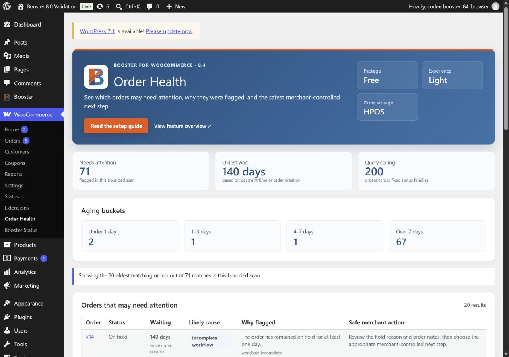

# Booster Free 8.4 product-page copy

## Hero

**Find delayed orders before they become customer problems**

Order Health Light gives growing stores a focused list of common payment and fulfillment delays, with clear aging and a safe next review. It never changes an order behind your back.

Primary CTA: **Explore Order Health Light**
Secondary CTA: **Compare Free and Elite**

## Value blocks

### Know where to start

See common failed-payment, pending-payment, delayed-fulfillment, and on-hold workflow signals instead of opening every order one by one.

### Understand every flag

Each result shows its current status, waiting time, a plain-language reason, and a safe review step. There is no opaque score and no AI-generated business decision.

### Keep performance predictable

The light experience examines at most 200 candidate orders and displays at most 20 attention rows. WooCommerce order APIs keep the same path compatible with HPOS and legacy order storage.

### Keep the merchant in control

Order Health is read-only. It does not change order status, issue refunds, contact customers, or automate a decision.

## Included in Free

- WooCommerce > Order Health branded dashboard
- Core delayed-order reasons for failed, pending-payment, processing, and on-hold orders
- Waiting time and aging buckets
- Safe merchant review guidance
- HPOS and legacy-storage support
- Fixed 200-order scan and 20-row display ceilings
- Stronger permission boundary for Booster option-reading shortcodes

## Available in Elite

- Status, likely-cause, and aging-bucket filters
- Custom-status configuration signals
- Partial-refund attention signals
- Privacy-safe Morning Store Briefing v1
- `booster/order-health-summary` read-only Ability
- Larger 250-order scan and 50-row display ceilings

## Screenshot

Suggested alt text: `Booster Free Order Health Light dashboard showing common delayed-order reasons, aging, and safe merchant review guidance.`

## FAQ

**Does Order Health change orders?**
No. It is a read-only monitor and guidance surface.

**Does it send store or customer data to an AI service?**
No. Booster 8.4 connects no AI provider.

**Will it work after enabling HPOS?**
The maintained Order Health path uses WooCommerce order queries and CRUD objects and is tested with HPOS and legacy storage.

**What does Elite add?**
Elite adds advanced filters, custom-status and partial-refund signals, Morning Store Briefing, the read-only Order Health Ability, and higher scan and display ceilings.
